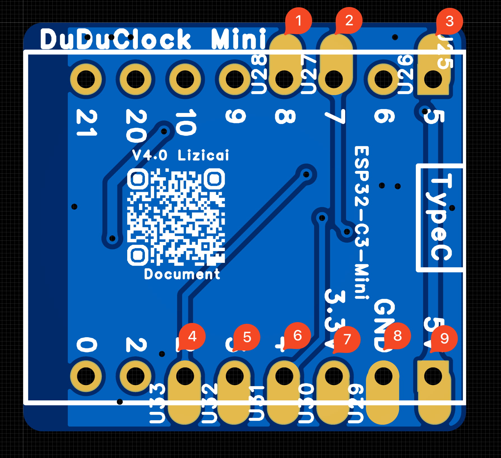

# DuduClock-Mini

## DuduClock

### 材料

- 2.4寸 ST7789 10PIN 插接款屏幕
  - 屏幕后面最好全金属不漏光
  - https://item.taobao.com/item.htm?id=594983854607
  - (背面全金属款)https://item.taobao.com/item.htm?id=671841914861
- ESP32c3-SuperMini 开发板未焊接排针
- 导热贴片买一个, SuperMini容易过热
- 下接翻盖座子(2种都可)
  - 下接翻盖座子 0.5mm 10p(易组装)
  - 下接抽屉座子 0.5mm 10p(稳固, 难组装)
- DuduClock-mini外壳 支撑架(MakeWorld地址)
  - https://makerworld.com.cn/zh/models/1313903
- 凯华静音微动黄点(红点) 6x6x7.3mm和2根线
  - 黄点红色都可, 推荐黄点手感略好
  - https://item.taobao.com/item.htm?abbucket=9&detail_redpacket_pop=true&id=832645716353
  - 2根, 每个60mm左右
- 0805 20欧和 0805 5.1欧
- 额外降压芯片(板载的容易坏,强烈推荐增加额外降压芯片)
  - AMS1117 3.3
  - 2个电容0805 10uf 
  - 2个电容0805 0.1uf
- 其他工具
  - 电烙铁
  - 加热台
  - 少量中温锡膏

### 焊接

- 使用锡膏焊接
  - 下拉翻盖底座焊接
    - 薄薄一层锡膏(小于0.1mm厚度)
    - 放上下拉翻盖底座
  - 涂锡膏, 放上电阻
    - 20R
    - 5.1R
  - 涂锡膏, 放上焊接额外的降压芯片  
    (板载上易坏)
    - AMS1117 3.3
    - 电容 10uf  * 2
    - 电容 0.1uf * 2
  - 放到加热台加热, 熔化后拿下来
  - 检查座子焊接好再进行下一步
- 焊接ESP32c3-SuperMini 和 PCB板子连接
  - 可以使用2.54针脚固定下, 再焊接
  - 
- 焊接按钮
  - 后盖拧好按钮
  - 焊接2根线和按钮连接
  - 再焊接2根线到PCB板子

### 组装

- 连接屏幕排线
- ESP32-C3 SuperMini 的Type C安装到壳子上
- 静音微动按钮安装到孔内
- 小心的放入支架
- 排线要折叠板子下, 插上屏幕
  - 也可顺便用706胶水固定屏幕
- 通电开机!
