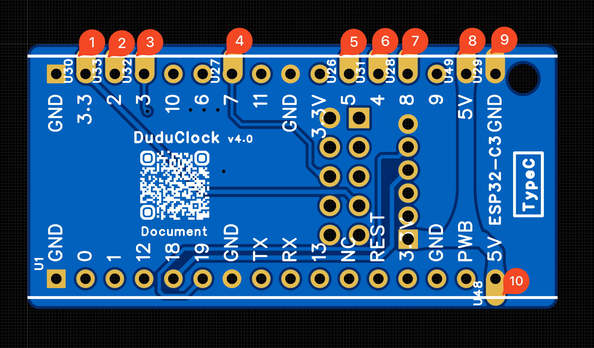

# DuduClock天气时钟

## DuduClock

### 材料

- 2.4寸 ST7789 10PIN 插接款屏幕
- esp32c3 未焊接排针
- 下接翻盖座子(2种都可)
  - 下接翻盖座子 0.5mm 10p(下接抽屉座子 0.5mm 10p)
  - 或者已焊接好的下接翻盖板子
- 外壳与后盖
- 12mm金属 高头 复位按钮和2根线
  - 注意高头 复位的
- 0805 20欧和 0805 5欧
- 螺丝与螺母
  - 平头螺丝 4个
    - M1.6 * 5 * 3 (直径 杆长 头部宽)
  - 通孔铜螺母  4个
    - M1.6 * 3 * 2.5 (内径 高度 外径)
- 额外降压芯片
  - AMS1117 3.3
  - 2个电容0805 10uf 
  - 2个电容0805 0.1uf
- 其他工具
  - 电烙铁
  - 加热台
  - 少量中温锡膏

### 焊接

- 使用板子上孔, 压入螺母
- 使用锡膏焊接
  - 下拉翻盖底座焊接
    - 薄薄一层锡膏
    - 放上下拉翻盖底座
  - 涂锡膏, 放上电阻
    - 20R
    - 5R
  - 涂锡膏, 放上焊接额外的降压芯片  
    (板载上易坏)
    - AMS1117 3.3
    - 电容 10uf  * 2
    - 电容 0.1uf * 2
  - 放到加热台加热, 熔化后拿下来
  - 检查座子焊接好再进行下一步
- 焊接esp32c3 和 PCB板子连接
  - 可以使用2.54针脚固定下, 再焊接
  - 
- 焊接按钮
  - 后盖拧好按钮
  - 焊接2根线和按钮连接
  - 再焊接2根线到PCB板子

### 组装

- 从外壳底部插入屏幕, 注意接线也要紧贴一起插入
- 可用706胶水固定屏幕
- 连接屏幕排线和PCB上的翻盖座子
- 扣上后盖, 拧上螺丝
