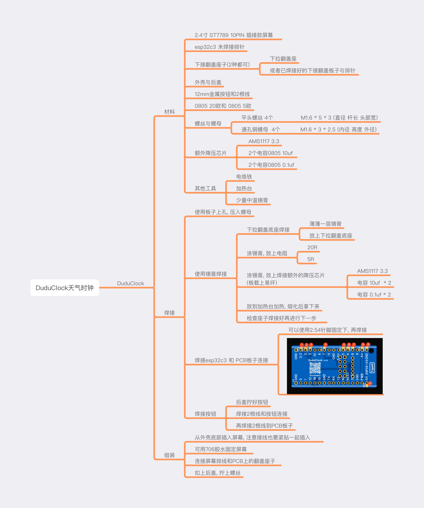

# DuduClock 嘟嘟天气时钟

### 外壳模型 [Makeworld模型](https://makerworld.com.cn/zh/models/1295111)
### PCB地址 [立创开源DuduClock](https://oshwhub.com/lixiaoming1988/duduclock)
### 固件地址 [固件地址](./Firmware/)
### 原码地址 [DuduClock_Firmware](https://github.com/leezicai/DuduClock_Firmware)
### 外壳购买闲鱼: 小新数码乐园

### 复刻DuduClock 嘟嘟天气时钟

* 固件史诗级更新: 和风天气数据可以跟配网一起配置了
* 线连接优化成PCB
* 外壳做了窄边框
* PCB做了限位无须胶水了, 屏幕仍然需要胶水固定
* PCB上孔位可辅助压入螺母

## DuduClock材料 焊接 组装

### [DuduClock文档-md](document/duduclock.md)
### [DuduClock焊接组装视频](https://www.bilibili.com/video/BV18jTNzaEU4)

