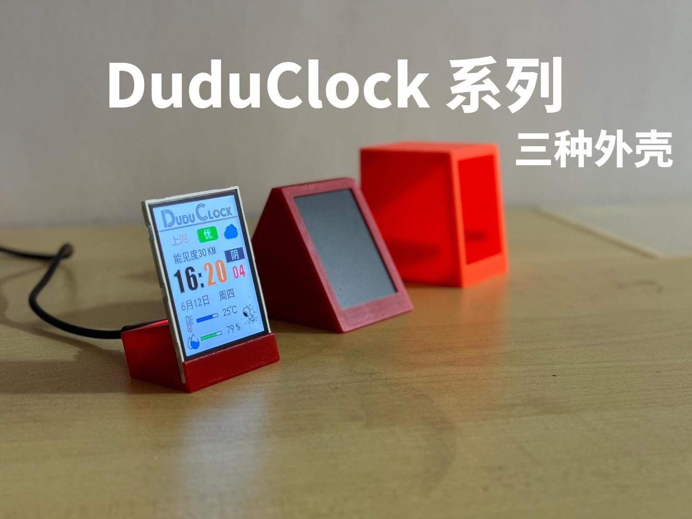

# DuduClock 嘟嘟天气时钟

## 模型 PCB 代码固件

### [Makeworld模型-DoduClock](https://makerworld.com.cn/zh/models/1295111)
### [Makeworld模型-DuduClock三角](https://makerworld.com.cn/zh/models/1309028)
### [Makeworld模型-DuduClock Mini](https://makerworld.com.cn/zh/models/1313903)
### PCB地址(打不开就是在审核中) [立创开源DuduClock](https://oshwhub.com/lixiaoming1988/duduclock)
### 原码固件地址 [DuduClock_Firmware](https://github.com/leezicai/DuduClock_Firmware)
### 成品和外壳购买闲鱼: 小新数码乐园

## 一 DuduClock材料 焊接 组装

#### 线连接更改成PCB 外壳窄边框, 更少胶水更好组装, 仅屏幕需要用到

### [DuduClock文档-图片](document/duduclock.jpg)
### [DuduClock文档-md](document/duduclock.md)
### [DuduClock焊接组装视频](https://www.bilibili.com/video/BV18jTNzaEU4)

## 二 DuduClock刷入新固件, 新固件-和风天气数据可配置

#### 固件更新: 和风天气数据可以跟随配网一起配置了

### 和风天气生成密钥工具 [Ed25519密钥生成](https://leezicai.github.io/tool/)
### 原码固件地址 [DuduClock_Firmware](https://github.com/leezicai/DuduClock_Firmware)
### [DuduClock刷入新固件-图片](document/DuduClock-Firmware.jpg)
### [DuduClock刷入新固件-md](document/DuduClock-Firmware.md)
### [DuduClock刷入新固件-视频](https://www.bilibili.com/video/BV1nvTqzzEjB)

## 三 DuduClock 嘟嘟天气时钟 三角外壳

### [DuduClock三角外壳-视频](https://www.bilibili.com/video/BV1fJMGziEDe/)

## 四 DuduClock Mini 嘟嘟天气时钟-迷你款

### [DuduClock-Mini-图片](document/DuduClock-Mini.jpg)
### [DuduClock-Mini-md](document/DuduClock-Mini.md)
### [DuduClock-Mini 视频](https://www.bilibili.com/video/BV1T1MAzZEUW/)

### 禁止商用
#### 购买成功或外壳闲鱼: 小新数码乐园
